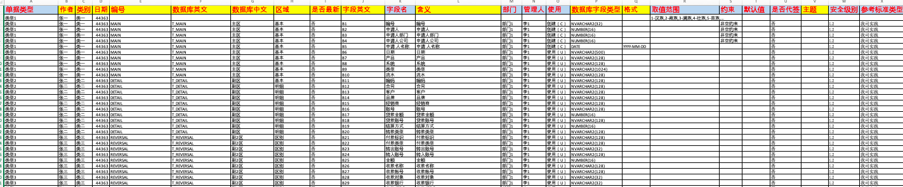
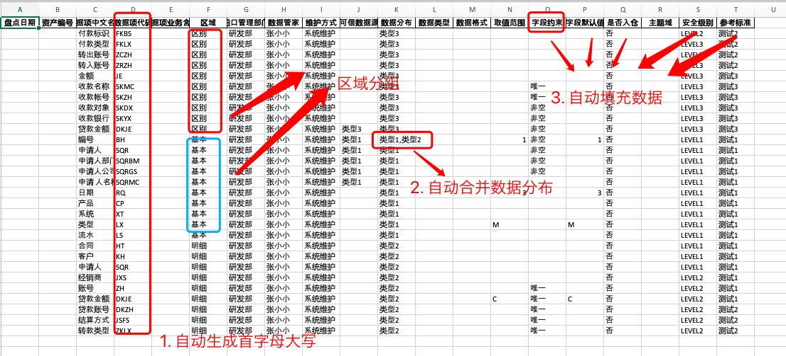

# 数据盘点统计

## 环境搭建
> 环境与库的使用说明及安装方法

|库/环境|安装方法|说明|
|--|--|--|
|python3.8+||本项目基于3.8版本开发, 不保证低于此版本的python出现的BUG|
|easygui|pip3 install easygui|主要用来显示图形对话框|
|pandas|pip3 install pandas|主要处理Excel表格|
|pinyin|pip3 install pinyin|主要实现数据项中文名称对应的数据项代码以拼单首字母展示(大写)，如: 编号 - BH|

## 工具使用步骤
1. 按照上述部署环境: [环境搭建](#环境搭建)
2. 运行 **export_to_excel.py**
3. 选择 **test/test.xls** 文件
4. 待提示成功导出数据信息，在当前目录下查看 **数据定标.xlsx** 文件

## 数据盘点设计背景
### 任务描述
> 通过数据盘点表中的数据，将数据定标表所需要的列信息进行统计后，生成对应表格文件

`任务列表:`
1. 从数据盘点表 **`test/test.xlsx`** 中筛选出 **`config.py中FILTERED_TABLE_HEADER`** 指定列中的数据
2. 对 **`区域`** 进行分组，之后再将各 **`区域`** 中的 **`字段名`** 进行分组，统计 **`各区域`** 中的 **`字段名`** ，但 **`只统计相同区域的相同字段名`**
3. 最后将分组统计后的数据导出为Excel文件

### 自动完成任务
0. 将数据按照 **`区域`** 进行分组
1. 自动获取 **`字段名`** 的 **`拼音首字母的大写形式`**，如: [处理后](#处理后)
2. 自动合并 **`使用`** 列中的数据，如: [处理后](#处理后)，
   **`注:`** 只有 **`同一个区域`** 中的 **`相同字段名`** 才会自动合并 **`使用`** 信息，而不同区域，相同字段名不会进行合并
3. 自动获取各列对应的值如: **`字段约束`**，如:  [处理后](#处理后)

### 结果前后对比
#### 处理前

#### 处理后
